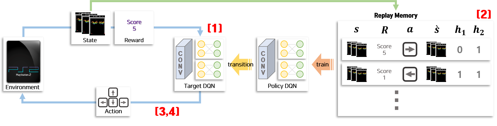

# Deep Exploration via Bootstrapped DQN, NIPS 2016
This is pytorch implmentation project of [Bootsrapped DQN Paper](https://arxiv.org/abs/1602.04621)

## Overview


Bootsrapped DQN is differ from DQN(Deep Q Network) with 4 main architecture

[1] Adapt multiple head in DQN architecture as ensemble model
[2] Add Bootsrapped Replay Memory with Bernoulli fuction
[3] Choose one head of ensemble DQN for each episod to make it run in training period
[4] Vote with best action of each heads when it comes to make action in evaluation period

> Detail description is supported in [my blog](https://joungheekim.github.io/2020/12/06/code-review/) which is written in Korean.

## Training Code
```shell
python breakout.py \
      --mode=train \
      --env=BreakoutDeterministic-v4 \
      --device=gpu \
      --memory_size=1e5 \
      --n_ensemble=9 \
      --out_dir=results
```
This is how you train atari game[Breakout].
There is many hyper-parameters to set.
Paper setting is provided as a default.
But please make sure that you got enough memory to train this model.
Because of **Repaly Memory**, It takes a lot of resources


## Result Visulization
```shell
python breakout.py \
      --mode=test \
      --device=gpu \
      --pretrained_dir=my_dir \
      --out_dir=animation \
      --refer_img=resource
```
After train your own model, you can run some game with your model.
I put some extra visualization code to make you enjoy.
To make animation, put *test* in `mode` option and *resource* in `refer_img` option.
`refer_img` option gives more enjoyable `GIF` animations.


## Reference
- [[PAPER]](https://arxiv.org/abs/1607.00148) Deep Exploration via Bootstrapped DQN, Osband at el, NIPS 2016
- [[PAPER]](https://arxiv.org/abs/1607.00148) Playing Atari with Deep Reinforcement Learning, Osband at el
- [[BLOG]](https://greentec.github.io/reinforcement-learning-second/) 강화학습 알아보기(DQN)
- [[BLOG]](https://joungheekim.github.io/2020/12/06/code-review/) [코드리뷰]Deep Exploration via Bootstrapped DQN
- [[GITHUB]](https://github.com/johannah/bootstrap_dqn) Bootstrap DQN(Pytorch Implementation)
